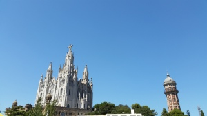

We got married on August 23rd, 2014 and we had a flight booked for Barcelona on August 24th in the evening- not the best idea we ever had given that we were up until 2AM celebrating. That being said, we were so happy about this trip and nothing could take away from that excitement!

Calin and I typically book Airbnb accommodations whenever we travel but for Barcelona Calin decided to splurge a little since it was the first stop on our honeymoon. We stayed at Gran Hotel Torre Catalunya which was very close to the Sants station so that made transportation very easy. It's a four star hotel so it came with what you'd expect of that rating. Bonus: the room was pretty big for a European hotel and the service was really nice too especially when they found out that we had just gotten married the day before :)

So what to do in Barcelona?

First, make the metro your best friend. Barcelona's metro system is fairly easy to navigate in terms of routes. However, I would make a point of reading up about the [types of tickets](http://www.mapametrobarcelona.net/en-precio-metro-barcelona.php) you can purchase. I think individual tickets were just over two euro's so it doesn't make sense to buy individual ones unless you're only taking the metro three times during the day. Find out the most economical pass for the types of trips you'll be making. Do your research beforehand and find out if you actually need the extra zones - most of the attractions are in the city centre and that pass shouldn't cost you more than 10 euros. Calin and I just walked a lot when we were there so the expensive passes we bought for the metro were a bit of a loss for us but we learned... for next time. Oh - and remember to check when metro lines stop working! One night we found ourselves trying to get home because we didn't know that the metro closed at midnight; we walked and it was lovely but it was a loooong walk!

Second, for food ALWAYS go outside the touristy areas if you don't want to spend a ton- avoid restaurants and bars near city centre/attractions/beach. One evening, Calin and I were really hungry but we had overspent on tickets to attractions and the metro and just wanted to eat for a decent price. We had been walking near the beach and decided to go in the small alleyways behind all the beachfront properties ... I think we walked for about 15-20 minutes and found a little place where we had an amazing meal with wine for under 35 euro's! We didn't get a seaview but the food and the service were excellent! I am writing this from memory so I don't remember what the restaurant is called... But I will tell you that we didn't have one disappointing meal in Barcelona. Another thing Calin and I decided to do to keep the costs down is to go shopping and bring things back to the hotel for next day's breakfast or snacks, etc. You'd be amazed at the quality of breads, meats, and cheeses you can get for very cheap in the city.

This brings me to my third thing to do in Spain, drink WINE! Lots of it! I am by no means a wine connoisseur but I appreciate good red wine so I was in heaven in Spain. Not only is it SO good but it is also so very cheap! You can get a great bottle of wine for about three euros or four if you're feeling fancy ;) If you don't like wine on its own, try sangria - you're in Spain after all.

Number four - most important: **take your time.** Barcelona is full of culture so read about something that interests you - art, history, architecture and go see it. Calin and I only had a few days in beautiful Barcelona but we wanted to take it easy and see things at our own pace. We didn't want to rush from one attraction to another just so we can check items off a list. So even though we didn't get to it all the places we did manage to see made us so happy. 

Five: An important detail to know about this city is that that it is part of a region called Catalunya. In this region, a different dialect, Catalan, is spoken (aside from Castellano/Spanish). Calin had been learning Spanish for some time leading up to the trip and he couldn't understand a lot of the Catalan. Luckily almost everyone we interacted with either spoke Spanish or English so that wasn't an issue.

I'm so glad we chose this place for our first stop as newlyweds; it was truly romantic and totally "us". It's a wonderful city to get lost in because there is a sense of openness about it - like the city is telling us: it doesn't matter, you'll find  your way... just enjoy the beauty for now :)

Oh! I started dabbling in making videos so check [this](https://youtu.be/scIo-2PB8qI) out if you want to see more of our Barcelona trip.

Happy travels,

Hiba

Other useful tips:

- Buy/reserve tickets to attractions online and in advance if you can. We went during the slower tourist season and couldn't purchase tickets on the spot to a few popular attractions because they were sold out.
- Museums are usually free on Sundays in the afternoon - can't recall exact timing.
- La Rambla is very touristy but worth a stroll in the early morning when it's less busy. La Boqueria (like an indoor market) is just off Rambla so that's worth a visit if you want to buy local, fresh food.
- Street art: Barcelona is full of talented and proud artists... take a minute and chat with them and maybe even purchase a piece you've fallen in love with.
- Tibidabo is SO worth it. It is a mountain overlooking Catalonia - there is a church and an amusement park at the very top; really interesting contrast if you ask me. Calin and I walked all the way up there and it was breathtaking; spectacular views of Barcelona and the coastline. If you do nothing else, go to Tibidabo. And if you walk all the way up it's even more satisfying ;)
- Safety: we had no issues regarding pickpockets and bag-snatchers etc. but we witnessed a couple of tourists reporting incidents to police and obviously they were very upset. Just be vigilant and smart about it; keep your bags/backpacks/cameras on your front especially in busy areas and the metro and only keep cards/cash on you that you need for that day.
