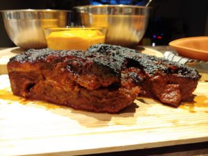
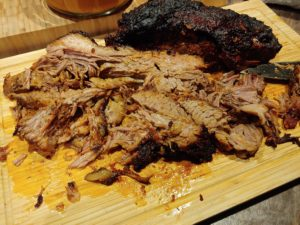
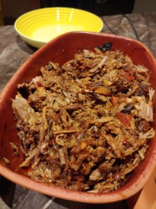
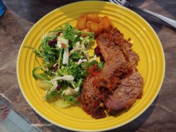

## Hiba's Beef Brisket

fall-apart and juicy

- 6 lbs beef brisket ((find a cut that's well marbled but don't be afraid of the chunk of fat))
- 2 shallots
- 4 tbsp red pepper paste ((I like to use mild but you can use hot if you like it spicy) )
- 6 tbsp tomato paste
- 3 tbsp chopped sundried tomatoes
- 3 tbsp red wine ((anything slightly acidic can work here - I've used rice wine before) )
- 3 tbsp soy sauce
- 1 tbsp liquid smoke
- 1 tbsp mango chutney ((you can replace this with honey if you don't have it))
- 1 tbsp Vegeta ((I mainly use this when I don't have veggies to layer at the bottom of the dish. It adds a nice flavour.))
- 2 tbsp smokey paprika ((smokey and sweet mix))
- 2 tbsp crushed coriander seeds ((don't skip this; it's my not-so-secret ingredient))
- 1 tsp black pepper
- salt ((to your taste))
- 3 bay leaves

1. Preheat your oven to 250 F and set timer for 6 hours (I usually go 1 hour per pound of brisket so this recipe is for 6 lbs)
    
2. Cut up shallots and put them at the bottom of whatever you're cooking in. Also on the bottom of the pan, put the bay leaves.
    
    Then place your piece of brisket on top of those.
    
    \*Very important\* make sure the fattier side is facing up! This will naturally baste the brisket and keep it moist during cooking.
    
3. Mix all the spices and all the liquids in a small bowl then pour all over the brisket.
    
4. Cover with 2 layers of tinfoil tightly! (As an alternative you could try making this recipe in a Terracota if you have one).
    
5. Put the brisket in the oven for 6 hours (remember, 1 hour per pound) at 250 F. Cooking time for fall-apart texture really all depends on the fat marbling (and whether you have the fat facing up) and how well you have it covered.
    

- You can literally cook this recipe with any spices you like (as long as you follow this rule: sweet, salty, and a tiny bit of something acidic)  because brisket is so forgiving if you cook it low and slow!
- Don't be tempted to take off much of the fat that comes with your brisket cut. Fat is flavour! More importantly, the fat also helps with the cooking so you don't need to add liquids like broth, etc. to this recipe. You can cut it off post-cooking. And like I said before, the fat should be on top so it drips down onto the rest of the cut as it cooks! 
- I also strain and save the drippings to cook with later. If you put them in a jar in the fridge you can see the fat goes to the top and broth stays at the bottom. With the fat you can do a multitude of things (use it to cook eggs, stiryfry, etc.) and with the broth/watery part, you can cook rice or tenderize potatoes -- just use as you would any broth (add to a soup to give it a deeper beefy flavour). 
- You can serve this brisket with a starch of your choosing (depending on who I'm feeding, I can do bread for sliders' style or even just simple potatoes or rice on the side). C and I just tend to it with a salad and veggies if it's during the week because it is a heavy dish. 
- Veggies that are nice on the side: tenderstem broccoli, garlic mushrooms, potatoes.
- I've done this recipe with a chuck instead of a brisket for when we've wanted something a bit more lean but still similar flavour. 
    
    \[caption id="attachment\_1628" align="alignnone" width="300"\] Don't be afraid if it turns out black on top like this - it's not burnt! It's all the sugars from the tomato paste and chutney that have been caramelizing in the fatty layer at the top... gives it an amazing flavour for those who miss bbq in the winter months.\[/caption\]\[caption id="attachment\_1629" align="alignnone" width="300"\] You can serve it like this in slices but warning; this is a recipe that is \*very\* fall-apart so it will look like this when you cut it if you're an amateur like me :)\[/caption\]\[caption id="attachment\_1627" align="alignnone" width="225"\] You can serve it in this style for sliders (pulled beef?)\[/caption\]
    

\[caption id="attachment\_1482" align="alignleft" width="300"\] This one was served with a kale/chicory/brussels sprout salad and some potatoes that I cooked with the brisket drippings.\[/caption\]
