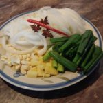
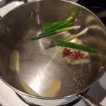
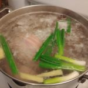
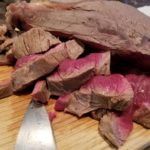
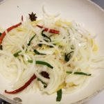
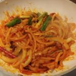
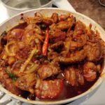
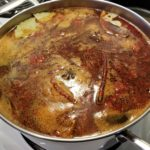
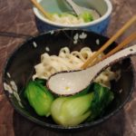

## Braised Beef Noodle Soup

Like a warm (spicy) hug.

- 1 kg beef shank
- ¼ cup olive oil ((or any other cooking oil you like))
- 6 stalks scallions ((cut into large slices))
- 1 stalk lemongrass
- 1 large white onion / shallot ((cut into long slices))
- 6 cloves garlic (whole)
- ½ handful ginger ((thin slices))
- 2 leaves bay leaves
- 2 pods star anise ((whole))
- 2 fresh chili peppers ((sliced in half and de-seeded) )
- 2 cups cherry tomatoes / regular tomatoes ((roughly chopped))
- 1 handful cilantro ((chopped))
- 18 small bok choys ((aim for 3 per serving - so 18 for 6 servings for this recipe))
- 1 package egg noodles (or whatever noodles you like, traditional recipe is with flour noodles) ((amount per serving is up to you))
- 2 tbsp spicy bean paste
- ½ cup dark soy sauce
- ½ cup regular soy sauce
- ½ cup rice wine
- ½ tsp gochujang
- 2 tbsp maple syrup or honey ((you can use sugar if you want))
- 2 tsp salt

1. I always like to prepare / chop anything I need ahead of time.
    
      
      
    
2. In a medium pot of boiling water, add half of the scallions, 1 anise pod, half the lemongrass, and half of the ginger.
    
      
      
    
3. Add whole beef shank and let boil for another 5 minutes.
    
      
      
    
4. Remove beef shank from pot and run under cold water then slice it into 0.5-1 inch pieces.
    
      
      
    
5. In a pan or wok, heat a bit of olive oil then drop in the aromatics (ginger, lemongrass, garlic, anise) and stir a bit for a minute. Then add the sliced white onion, scallions, and chili. Stir.
    
      
      
    
6. Let cook until white onions become soft then add the spicy bean paste, gochujang, and honey or maple syrup.
    
      
      
    
7. Now add the sliced beef. Stir. Then add the dark soy and stir. Add rice wine and stir. Add tomatoes and stir. Let simmer for 10 minutes.
    
      
      
    
8. In the same pot you used before to boil the beef shank, dump the old water and put clean water then add everything from the pan including the cooking liquids. Add more water if needed to cover the meat. Add a pinch of salt and the bay leaves. Cover and let boil on low for 2.5 hours.
    
      
      
    
9. While you wait, you can cook the noodles according to package instructions. Put aside.
    
10. While you wait, you should also cook the bok choy. Boil some water and add the boy choy for three minutes then remove and put aside for later.
    
11. To assemble a beautiful presentation of this soup, you'll need a deep bowl. Add noodles at the base, then bok choy.
    
      
      
    
12. Then pour soup and meat on top. Garnish with cilantro and scallions.
    
      
      
    
13. Enjoy with friends and family ;)
    

This soup is a result of experimenting with a few Taiwanese-style braised beef soup recipes like [this one from Tasty.](https://tasty.co/recipe/taiwanese-beef-noodle-soup) We made a few changes to suit our dietary preferences and tastes (i.e. no sugar), added egg noodles instead of regular flour ones, and added lemongrass and gochujang sauce which weren't in the original recipe. This is how we like it and feel like we'll probably keep this on rotation in our meal plans. It seems intimidating at first but it's actually quite easy once you make it a couple of times. 

Enjoy! Stay hungry, as C says.
