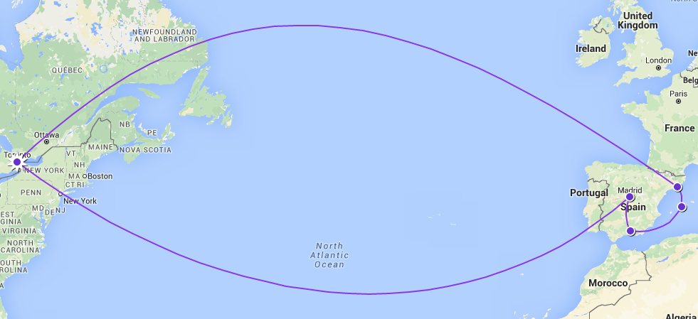
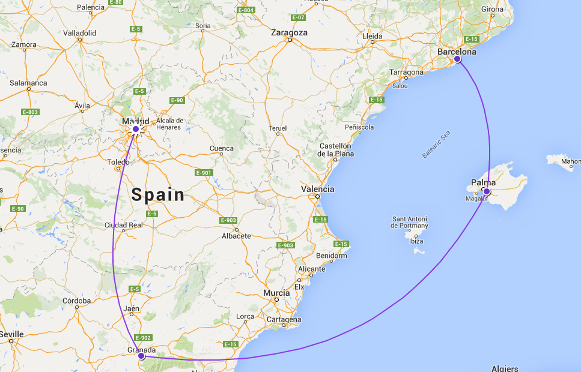

Over the next few weeks, I'll be importing my old blog posts from our Spain trip. Why? I want to have a record of it here in case we get rid of the old blog. It has been my favourite trip to date. Enjoy!

We've been wanting to write about our trip to Spain for a while now but there is so much to cover... where do we start?!

As we prepared for the wedding over the summer the honeymoon trip was truly what we were excited about most. So much so that we booked a flight departing the Sunday after our Saturday-wedding! Not something we'd advise newlyweds to do because we were exhausted after all the festivities. Regardless, it ended up being an amazing experience.

How did we decide on Spain? Well, Calin was learning Spanish so that was part of it. The truth is that Calin and I have never travelled alone together; we've always travelled with friends or family. So we wanted our honeymoon to be solely ours. We picked a place where we didn't have family or friends :) It may seem selfish to some people but we really needed time to ourselves as a couple since we both had a stressful year with our jobs and schooling.

We decided on four main places to explore in Spain: Barcelona, Majorca/Mallorca, Granada, and Madrid. We will dedicate a post to each spot in the coming months... it will include stories and general tips on travelling in each of those spots. We hope you'll enjoy reading about them as much as we enjoyed reminiscing and writing about them.

Love,

Hiba and Călin.

 
