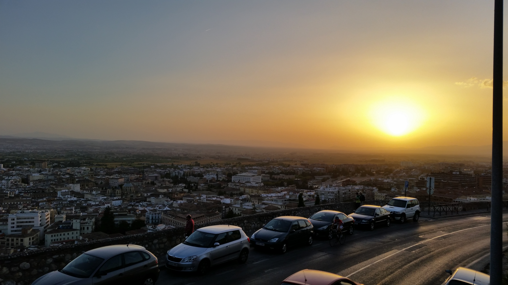

Calin: Only recently I married a beautiful, talented, witty, and loving woman named Hiba. She has made my life feel more vibrant and given me a life long partner to travel and eat with! We both love food, culture, and travel... we won't stop until we see/eat everywhere in the world we can reach. If all my dreams come true I will one day open a food stand or small cafe which I will run while my wife writes. In this blog, be prepared for beautiful views, delicious treats, and touching moments.

Hiba: Well, after that introduction I should just take a bow ;) This blog is an attempt at sharing our adventures with our loved ones so if we pick up a few new friends along the way, all the better :) Enjoy!

\[caption id="attachment\_7" align="alignnone" width="656"\] Sunset in Granada, Spain\[/caption\]

Thank you for reading, and as always, stay hungry and happy travels.

C & H
