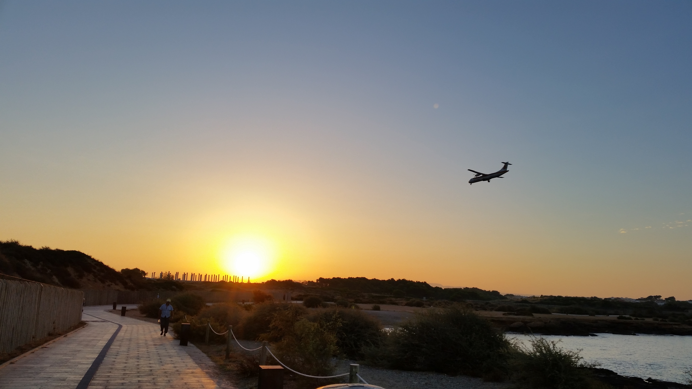

I've been putting off this post for a while because I don't have much in terms of information to say about Mallorca. We decided to put this island on our itinerary because we needed a few beach days to just take a break and soak up the sun. We flew from Barcelona into Palma, took about an hour, but because Palma was so expensive in terms of accommodations we opted to stay in Can Pastilla which was pretty close to Palma anyway. We spent a couple of days lounging and reading at the beach in Can Pastilla before we headed to Porto Cristo to see Cuevas del Drach which I'll get to in a bit.

I had done a bit of research on the Balearic island before we left home and I was under the impression that all the islands (Mallorca, Menorca, and Ibiza) were popular with German ex-pats and tourists. However, Can Pastilla in Mallorca seemed to have a lot of British expats; almost every other person we chatted with was from Britain. One night we decided to go out for a stroll and a drink; the bar we found ourselves in a bar that was owned by a Brit and everyone in there was 40+ and British. We had a lot of fun that night. The older gentlemen found out that Calin was newly married and offered him lots of good advice about listening to his "gorgeous wife" and "staying in her good graces". Not that he needed it. Anyway, everyone we met was friendly and easy-going in Can Pastilla.

I found the island to be a bit bittersweet though. We met a lot of people trying to make a new start there... usually it was Brits who have opened pubs for the first time ever and found themselves to be struggling in the off-seasons. One night we were having a glass of wine at a patio and a young Spanish guy, who was probably only a couple of years older than us, came out to serve us a plate of tapas. At the end of the evening he came to clear our table we starting chatting with him and found out that this was his restaurant. He was so passionate about the wine and the food he served - and you could tell, those tapas we had were probably the best we had on our trip to Spain. He surprised us when he, too, told us he's thinking about closing up shop because the business is only good when tourists are around in the summer. We asked him what his plan was if he were to shut down this place and in his broken English and our broken Spanish we managed to understand that he's just going to take it day by day and see what happens. His dream since he was little was to move to the islands and open up this place. I mean, what could we say to him to console him?  Language was a barrier but that wasn't even it. He smiled and told Calin, in Spanish, he'd find another dream to chase.

Anyhow, did I tell you the hotel we stayed at was owned by a lovely old couple who had a curfew for hotel guests? We were out of luck if we were to stay out past 2 AM because that's when they locked the front doors. That's a story for another time :) But below is a photo of our lovely patio at that weird hotel. 

On the second last day in Mallorca we decided to take the bus across the island to spend the day in Porto Cristo to see the caves. The bus ride from Can Pastilla to Porto Cristo took 2 hours but it was worth it. First off, Porto Cristo is everything I imagined it to be... I fell in love hard with that port; I started wishing we had stayed there. That's when I know I want to go back to a place. Porto Cristo is one of the few places left in Mallorca that doesn't depend solely on tourism; this small town has a healthy fishing and pearl manufacturing industry. I also found it to be a lot less touristy than Palma and Can Pastilla. We found other tourists when we went to see the caves but the town itself seems to have a connected and lively community which was a nice change from what we were seeing in Can Pastilla. 

When we were in town we wanted to have seafood paella for lunch at this lovely spot...

But we were running a bit late for the caves tour so we had to take it to-go. It was still really good even though I'm vehemently opposed to eating hot food out of plastic containers.

So, Cuevas del Drach/Coves del Drac (lit. Dragon Caves) are a must if you find yourself in/near Porto Cristo. These caves are home to one of the largest subterranean lake in the world: Lake Martel. It's warm (just over 20ºC) and very humid (80%) in the caves. Side bar:  with this information in mind, I couldn't understand why some people brought their babies into the caves. I'm usually pretty empathetic towards parents with babies when other people give them the side-eye because their baby is crying on the plane. BUT, this was a hot, humid, and dark place - why anyone thought it was a good spot to bring a baby here is beyond me. Anyway, the coolest part of the cave tour is the concert. There is a 15 minute classical music concert where the musicians come out on little boats lined with lights... It was  so dark in there so the reflection of the boats' lights and the music echoing was just magical - except, you know, for the crying babies :p

I've included some photos/short footage in the [video](https://youtu.be/Ig3j_3LICD8) to give you an idea of what it was like during the concert although the video can't possibly do it justice.

I hope you enjoyed reading about our little stop in Mallorca. If you find yourself on the west coast there then definitely try to get to the east coast and at least see Porto Cristo and you'll notice the difference between the two spots even though it's a small island.

Next post will be about my favourite place from this trip: Granada.

Happy travels,

Hiba

