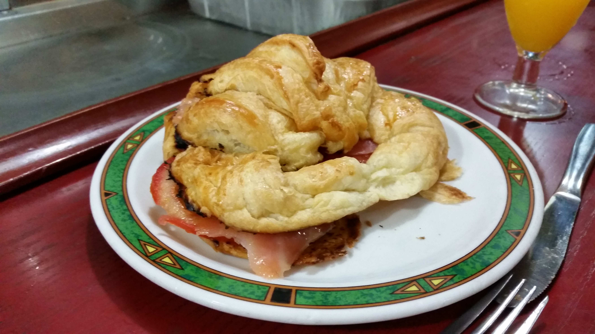

And the last honeymoon trip post :) Calin wrote most of this but I include it anyway because I just love reading through these and reminiscing. Enjoy!

 

 

Here is [our video](https://www.youtube.com/watch?v=DiynNV7Ofm4) for Madrid!

This post is short because we only spent 2 full days in Madrid.

To get to Madrid we took a bus from Granada. This was the cheapest, but not the most comfortable - as we found out - way to get to the capital of Spain. After a few hours in the buss, even though we had the seats at the very back with lots of leg and elbow room, we both got seriously carsick... Maybe it was also the extreme heat and AC temp difference in the bus. A stop for some refreshments helped us quite a bit and we got to stretch our legs, but by the end of the 5th hour of travel when our bus finally arrived at the station in Madrid we promised each other we would never do that again; train next time.

Because our time in Madrid was to be so short we wasted no time. We headed straight to the hotel - the cheapest and smallest of all the hotels during our entire trip - to drop off our things. It was late by the time we got comfortable so we headed out that night for a light snack. To our surprise there was a small bar/cafe right across the street from our hotel where we found the cheapest food and drink we had during our entire trip! A quick stop in that evening got us a croissant with smoked salmon and tomato slices for only 1.75€. Following our late snack we allowed the food coma to rock us gently to sleep and bring on a new fresh day.

The next morning we got up early and hit the same little cafe for breakfast so we would have the energy we needed to explore the city. We booked it to the subway, next stop: the center of town.

We arrived in the center of Madrid and as we were making our way out of the dingy subway and into the brightly lit square I stopped a McCafe. To our surprise, since we have never been to one outside of Canada, this McCafe has a wonderful selection of hot beverages and tasty treats! We proceeded to load up on "macarons" and purchase a second pack for the journey home. 

With our bellies full and the sugar rush kicking in, a brisk pace carried us to the nearby Royal Palace of Madrid. Beautiful on the outside and from within... however, photos were not allowed inside the Palace so I had to ninja snap some to expose the gold hording this palace has been undertaking.

Following our visit to the palace we took a long walk down the small and crowded streets of Madrid. The map told us we were headed for the Temple of Debod - the Egyptian gift to the Spanish, which was neat. It was a little tomb-like structure with a large fountain in the center, and from its vantage point you could get a beautiful view of the city.

Hot, tired, and hungry (again) we headed for the transit. Our next stop was Mercado de San Miguel where we found some of the most delectable food we have had so far on this journey. The market had plenty of small samplers, personal sized pizzas, oysters, cheese stuffed olives, etc. We fueled up and headed straight for Buen Retiro Park, a large and beautiful park with many sights and activities.

\[gallery ids="832,833,834" type="circle"\]

Buen Retiro, aside from the spots on the grass which appeared to be reserved for couples vigorously "making out", had plenty of beautiful scenery and activities. We didn't feel like getting wet so our journey did not take us boating across the lake; however, this was an option here and many took advantage.Following our walk past the big pond, and the lovely archways of the large Buen Retiro displays, we found ourselves heading towards something called "The Crystal Palace" which captivated us simply by its name. As we made our way there we were greeted by a school or turtles, and a lovely waterfall flowing over a small cave. Yet what awaited us in the crystal palace was much more beautiful. This small sliver of Madrid is a bookworm's paradise. It is a large palace made of nothing but glass, the palace is filled with comfortable rocking chairs with books strapped to their legs and is kept quieter than a library. Security is on scene during opening hours to ensure everyone keeps the noise to a minimum. The sound of birds, the breeze in the nearby trees, and the flipping pages in your hand is all you hear. Hiba and I spent the rest of the afternoon here in peace, pondering and relaxing...

In the evening we walked around the streets of Madrid trying to soak up the little time we had left there. But eventually our feet grew blistered and tired so we decided to head back to the hotel and pack our things for our early flight the next day.

Spain will always be special for me because Hiba was by my side. We left Spain with plenty of memories and lots of love. We will definitely go back one day when we're a bit older and we've seen more of the world.

As always, stay hungry my friends.

Calin.
