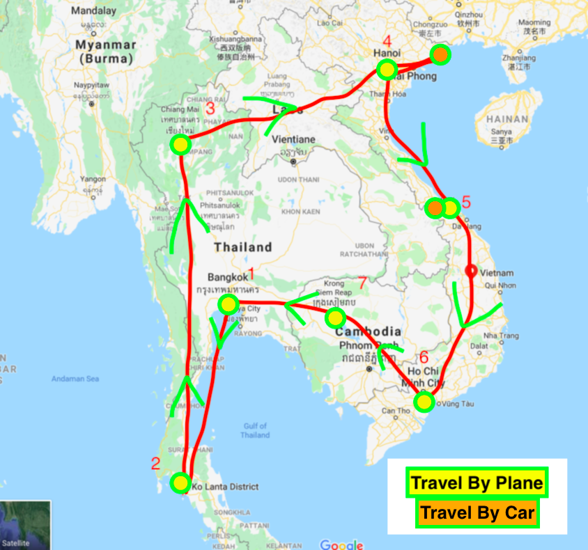

Where to?  
Initially we wanted to explore Thailand, Cambodia, and Vietnam with some friends during my two-week winter break. However, as we started our planning we quickly realized that we had to drop one of those destinations because we simply didn't have enough time. We settled on Thailand because that's a place our friends really wanted to see and who can deny the magical pull off tropical islands? And of course, I've always wanted to see Vietnam. I've read all kinds of fiction and non-fiction that waxed poetic about how enticing this country can be so I made sure to put it on the itinerary. I wasn't happy about having to drop Cambodia but it just meant we would have to return to the area one day.

- 
    

Vaccinations:  
We went to a travel clinic to get all the shots and pills we'd need "just in case". I felt like it was very pricy (around $400 for both of us) but our health plans covered most of it and it's better to be safe than sick while traveling.

Bookings and accommodations:

We a bit of money on our flights by leaving mid-week instead of the Saturday when the Christmas holidays begin. For Airbnbs and hotels, I highly recommend you book early especially during holiday season - everything is overpriced and books up fast as we learned the hard way :( Thailand isn't as cheap as it used to be so booking early is a must if you want anything reasonable. And in Vietnam places book up quickly around the holidays and New Year's Eve.

Packing?  
Because we packed so much into this short trip we decided (at the advice and urging of my sister and her husband) to travel light. We thought we used to travel light with just a carry-on (we even did our honeymoon that way) but little did we know they meant backpacks! The more we thought about it the more it made sense; we were going to be on the move a lot during this trip. So we ordered a couple of backpacks off Amazon. Calin's us the brown one and mine is the red. After packing it, I realized the size was too big anyway but it was too late to exchange it before our trip. So here's what I packed for 2-week trip to Thailand and Vietnam!  
7 outfits:

- four dresses (a couple of elegant ones as well as two casual ones)
- two outfits consisting of shorts and tops
- enough undergarments for 7 days
- 3 pairs of shoes (flats for elegant dinners, cute comfy sandals for daily wear, and my trusty Birkenstocks which I can also use on the beach. Also wore runners the airport so technically had 4.)  
    _Keep in mind we booked mostly Airbnbs and some have laundry so it was very easy to pack this way_  
    Miscellaneous:
- credit card and some cash as well as our travel health insurance card
- battery pack for our phones
- chargers+convertor
- earbuds
- toiletries, a little make-up, sunscreen (all liquids under 100ml -lots of stores cater to this now) etc.
- book to read on the plane
- some dry snacks

Even with all that we still had room in our backpacks. Also, we wore raincoats and comfy clothes/runners to the airport so it's not like we skimped on warm clothes either for the trip back. All I'm saying is that it's possible to travel this way and do it comfortably too without much sacrifice! You just have to be super thoughtful about what you're packing. Also, shopping is supposed to be great in Bangkok so it was a must for us to leave some room to come back with a few new items for our wardrobes. We're also hoping to get a suit and a dress tailored in Vietnam so those will definitely fit in there too.

Anyway, that's all in terms of our preparations. My goal is to write as we go when I have down time. There are a bunch of trips I haven't written about yet on the blog because I kept thinking "I'll do it at home" but then you get home and get busy… So I'll see if this works a little bit better. And in the future I'm going to try fill in the gaps with the older travels from the last couple of years :)

Until then, stay kind.

H
